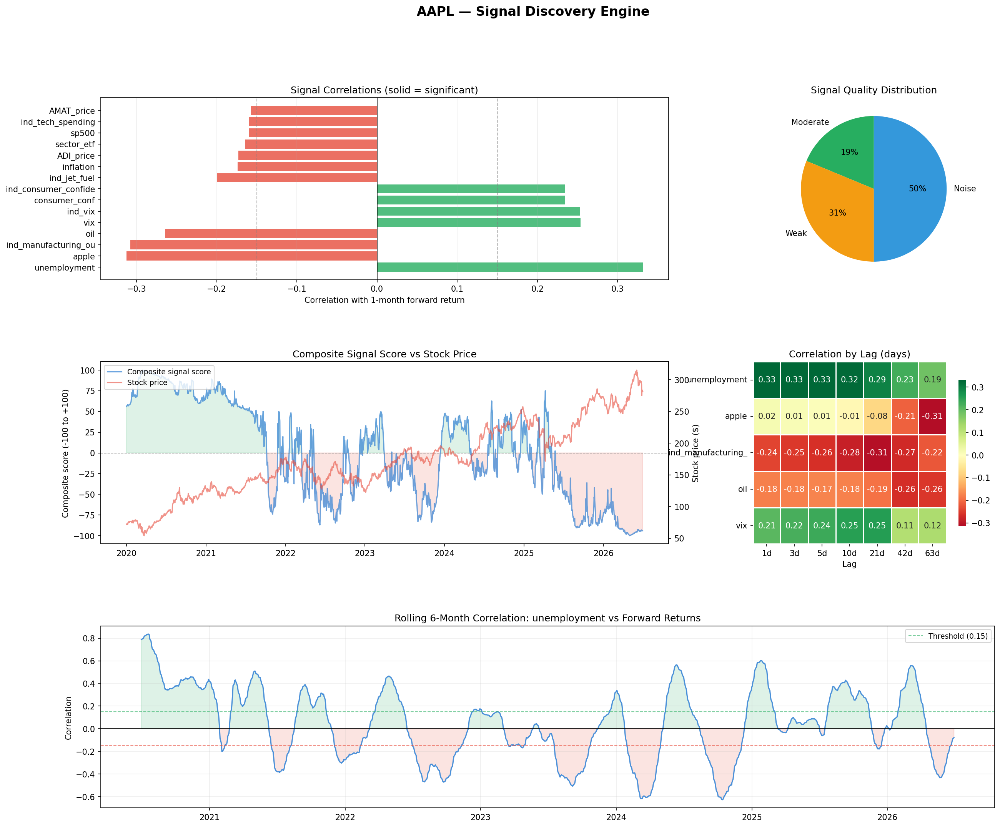
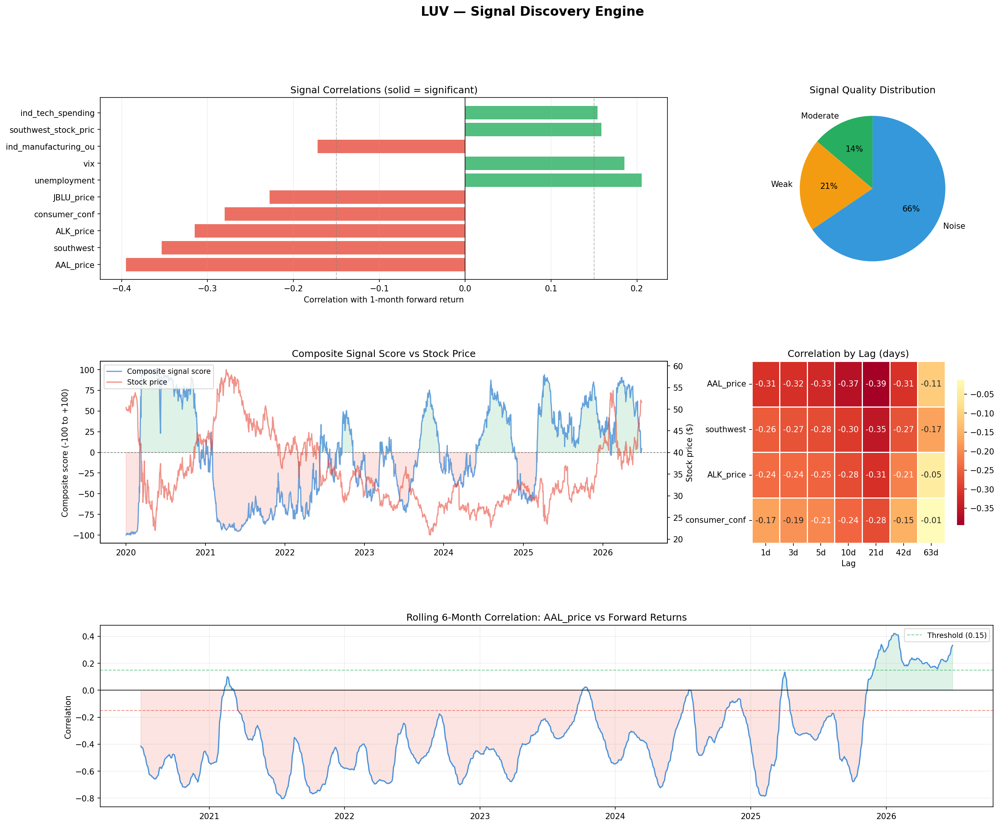

# Signal Discovery Engine

I built this because I wanted to answer a pretty simple question: for a given stock, are there outside signals like macro data, commodity prices, competitor moves, or search trends that actually lead the stock price?

And if there are, do those relationships actually hold up over time, or do they disappear once the market changes?

## What it does

For any ticker, the project pulls together a bunch of different data and compares it against the stock’s future returns:

* Stock price and forward returns from Yahoo Finance
* Macro data from FRED, like interest rates, inflation, unemployment, VIX, oil, and the dollar
* The stock’s sector ETF and the S&P 500
* Competitor stock prices, found automatically by identifying the company’s industry and ranking similar companies by correlation
* Google Trends search interest
* Industry-specific data based on what the company actually does. For example, an airline might get jet fuel prices and air travel demand, while a bank might get interest rates and the yield curve

For every signal, it checks a few things:

Does it correlate with future returns? What time lag works best? Is the relationship statistically significant? And more importantly, does that relationship stay consistent over time or does it keep flipping around?

## What I found

* Most signals are basically noise. For a typical large-cap stock, around 50–90% of the signals I tested didn’t pass the significance threshold.
* Even a lot of the signals that looked significant weren’t very stable. A relationship could be positive for one period and negative for another, which makes it pretty useless for prediction.
* Different stocks are driven by different things. Apple and Google were influenced more by broad macro signals, while Southwest (LUV) was influenced more by other airline stocks, with the strongest relationships showing up around three weeks ahead.
* Some relationships that seem obvious aren’t actually that useful. I expected jet fuel prices to clearly lead Southwest’s stock, but they didn’t. Airlines hedge fuel exposure, and the market probably reacts to those price changes pretty quickly anyway.
* The strongest correlations I found were usually around 0.3–0.4. That’s interesting, but still too weak and unstable to treat as a real trading signal by itself.

## Example output

Each run produces a report like this:





## Running it

```bash
pip install -r requirements.txt
cp .env.example .env      # add your free FRED API key
python data_pipeline.py   # build the data for a ticker
python signal_engine.py   # run the analysis and generate the report
```

## Files

* `data_pipeline.py` pulls and combines all the data for a ticker
* `industry_signals.py` handles the industry-specific signals
* `signal_engine.py` runs the correlation, significance, lag, stability, and visualization analysis

## Limitations

* Everything here runs on daily data. A lot of lead-lag relationships are probably stronger at intraday frequencies and fade by the time you get to daily data.
* Right now, the project looks at a stock’s absolute returns. A better version would probably compare the stock against a basket of similar companies, which would remove some of the broad market noise.
* Since the system tests a lot of signals across a lot of different lags, some results are going to look statistically significant just by chance. That’s why I care more about whether a signal stays stable over time than whether it simply has a low p-value once.

Built with Python, pandas, NumPy, SciPy, matplotlib, yfinance, and the FRED API.
